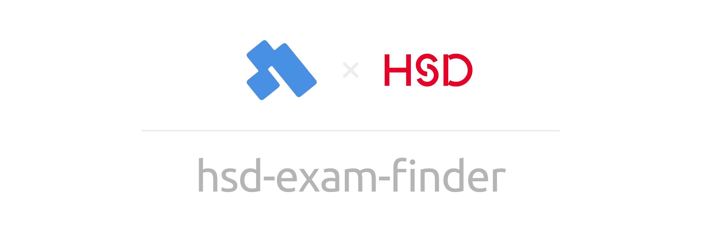
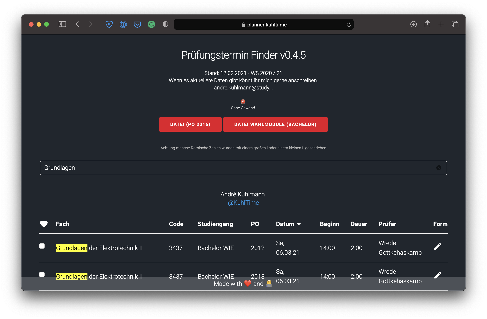

<p align="center">
  
</p>




This is a small website that should help students keep track of their examination dates.

**Visit: [planner.kuhlti.me](https://planner.kuhlti.me)**

## 📖 Description

### 🤔 Why?

All our examination dates get published inside a huge PDF file. In order to keep track of my exams I decided to create this little website.

### 🤭 Problem

Because there only is a PDF file provided by our university, I have no good way of automating the extraction process. For now I am using a tool called [Tabula](https://tabula.technology).

### ☝️ TODO

My original intention was to automatically get notified when the date of one of my exams changes. In case I would get my hands on some kind of automation for the extraction process I would definitely spend some more time developing  this website.

## 🌈 Setup

In order to get up and running on your computer follow these steps:

1. Install [NodeJS](https://nodejs.org) on your computer
2. Download the repository
3. Install the dependencies
    ```sh
    npm install
    ```
4. Start the development server
    ```sh
    npm start
    ```

## 🖥 Tech Stack

Because this was a quick weekend project and the website is not very complex I am using "vanilla" JavaScript + [jQuery](https://jquery.com).

## 👩‍💻 You want to help?

- You can code?
- Have any suggestions / ideas / questions?
- Want to tell me that you like my tool?

I would love to hear from you! 😍


